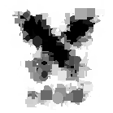

# Python Image "Shape Approximation Filter" Project

Approximating images using random shapes with random attributes and evolution aspects.

Specifically inspired by [Spu7Nix Geometry Dash image algorithm video](https://youtu.be/6aXx6RA1IK4?t=272) (Link [here to timelapse](https://youtu.be/6aXx6RA1IK4?t=348)) but I'm sure other similar filters exist.

As a challenge, this is created from scratch in **Python 3.10.1** primarily using **Pillow** without examining other attempts

Utilizes *testing* and *logging* and *Abstract Classes*.

## Algorithm Steps
1. Color Difference Map between canvas and target
2. Generate *n* random shapes with random attributes
    - colors based on average value of target image at position
3. Calculate score based on Color Difference Map with and without shape for each shape added
4. Rank best shapes
5. If max iterations or hit threshold of improvement of image, go to step 9
6. Keep subset of best shapes
7. Generate children of best shapes using small tweaks to attributes
8. While iterating, Go to step 2
9. Once found, apply best shape to image
10. If max iterations or hit threshold of similarity between canvas and target, complete. Otherwise go to step 1

## Images

Sample: initial image | Brute Force (no evolution) | Refined Settings

### WIP Project